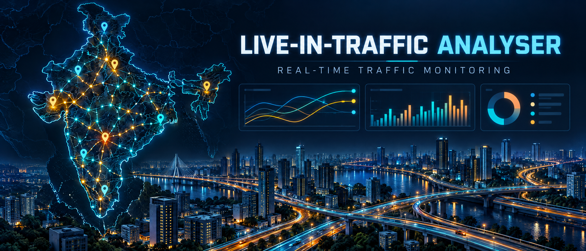

# Live-in-Traffic-analyser

### Real-time traffic monitoring for drivers, commuters, and planners

---

## About the project

**Live-in-Traffic-analyser** is a Pan-India real-time traffic monitoring platform designed to help drivers, commuters, and planners understand traffic conditions and respond to incidents.

## Features

- **Live traffic maps** for monitoring road conditions
- **Traffic alerts and incident reports**
- **Traffic analytics** for understanding traffic patterns
- **Real-time updates** powered by WebSockets
- **Responsive, mobile-friendly interface**

## Tech stack

`Next.js` · `React` · `TypeScript` · `Leaflet / Mapbox` · `Node.js` · `WebSockets` · `PostgreSQL / PostGIS` · `Redis`

## Project goal

To make traffic information easier to understand and more useful in real time — from live map updates to actionable alerts and analytics.

---

Built by [Inba Thamizhan](https://github.com/inbathamizhan-tech) · [Connect on LinkedIn](https://www.linkedin.com/in/inbathamizhan-k-2a5712431)

